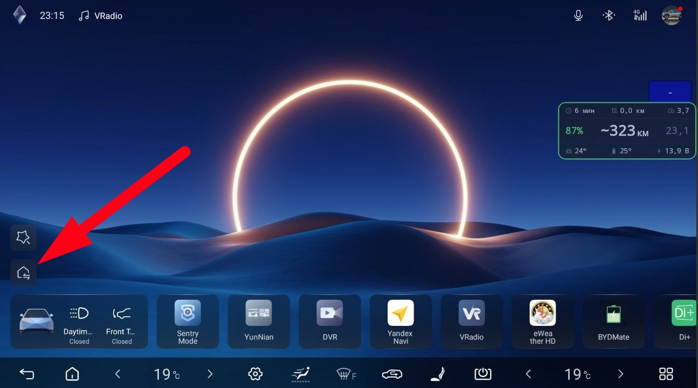
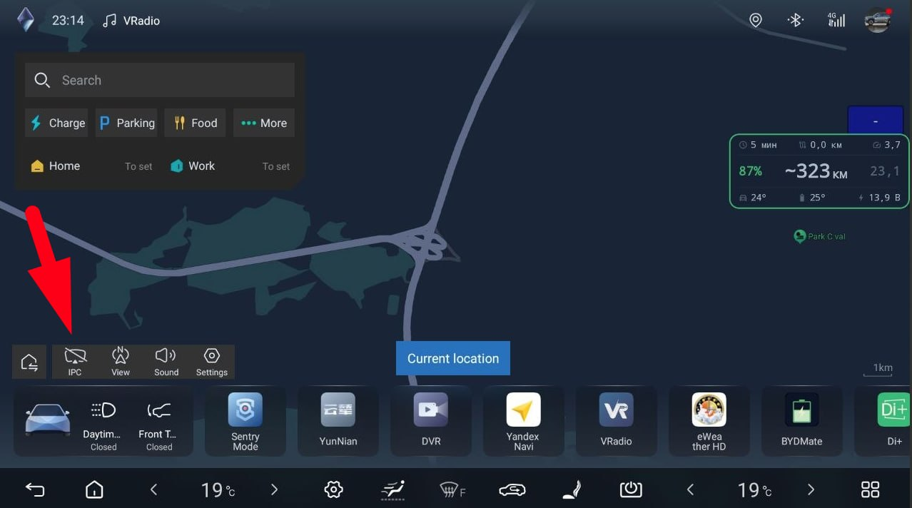

<div align="center">


# BYDMate

### BYD DiLink 5.0 行程记录与能耗分析

[](https://developer.android.com)
[](https://kotlinlang.org)
[](https://developer.android.com/jetpack/compose)
[](LICENSE)
[](https://github.com/AndyShaman/BYDMate/releases)
[](SUPPORT.md)

**真实能耗、GPS 路线、自动化、AI 分析 — 本地优先，云端功能可选。**

**中文** | [English](README.en.md) | [Русский](README.md)

[功能](#功能) | [截图](#截图) | [自动化](#自动化) | [投射到仪表盘](#投射到仪表盘) | [AI 洞察](#ai-洞察) | [ABRP](#abrp--实时遥测) | [安装](#安装) | [编译](#从源码编译) | [赞助](SUPPORT.md)

</div>

---

## 关于

BYDMate 是一款运行在 BYD DiLink 5.0 车机（方程豹 钛3）上的 Android 应用。它可以记录行程、GPS 路线、BMS 真实能耗、充电记录，并提供 AI 驱动的驾驶分析。无需 Google Play Services。

原车车载电脑**低估能耗约 10-30%**。BYDMate 直接从 BMS（energydata SQLite）读取数据并显示真实数值。此外还提供了原车系统没有的数据：停车耗电、电芯均衡、行程费用、AI 洞察。

核心功能（行程、充电、自动化、本地洞察、离线语音助手）完全在车机本地运行，无需联网。云端功能默认关闭，仅在手动输入密钥后启用。数据流向详见[数据与网络](#数据与网络)章节。

---

## v3.5 更新内容

**俄语离线语音 AI 助手。** 一个完整的语音代理，语音识别完全在车机本地运行（无需云端），可听懂俄语口语：读取车辆实时数据，控制车身（车窗、空调、座椅、门锁、天窗、后备箱、冰箱、灯光），规划路线、播放音乐、运行和创建自动化，并用神经网络 TTS 语音回答。由大语言模型（OpenRouter / 免费 z.ai / 自建服务器）驱动；简单指令完全离线即时执行，无需联网。

该助手**仅支持俄语**：BYD 原车助手已覆盖英语和中文，BYDMate 只补齐车机缺失的俄语。完整说明见[俄语 README](README.md#голосовой-ai-агент)。

3.5 还包括：通过语音将 Yandex 导航投射到仪表盘、新增"语音短语"自动化触发器，以及在车机本地计算的每周/每月洞察。

---

## v3.0.0 更新内容

这是一次重大更新。BYDMate 迁移到了自有数据栈，并支持将导航投射到仪表盘。

**自有数据栈，不再需要 D+。** 早期版本依赖第三方 D+（迪加）应用来读取车辆数据。现在所有数据读取和命令发送均直接通过车辆系统服务完成，无需中间人。安装并验证 BYDMate 正常后，可以从 DiLink 上卸载 D+。SOC、功率、温度、容量、电压、充电枪状态、SoH 和里程均直接从源头读取。灯光、空调、车窗、后视镜和后备箱也是直接控制。

**Yandex 导航投射到仪表盘。** 方向盘右星键可将导航投射到仪表盘或切回中控屏。默认投射 Yandex 导航，但可选择任意应用。详见"投射到仪表盘"章节。

**睡眠充电。** 车辆深度睡眠且应用关闭时完成的充电，现在可以从两个 SoC 点正确重建记录。此前这类充电可能会丢失。

**悬浮窗和自动化。** 悬浮窗新增每 1% 电量行驶公里数和车内、电池、12V 温度显示。自动化新增按精确时间和时间范围（含星期选择）的触发器，规则编辑器新增"立即运行"按钮。

---

## 功能

| | 功能 | 描述 |
|---|---------|-------------|
| **BMS** | 真实能耗 | 来自 BMS（energydata）的数据，而非原车估算。以 25 公里滑动窗口显示趋势 |
| **GPS** | 行程记录 | GPS 路线、距离、速度 |
| **Charge** | 充电记录 | 自动记录 AC/DC 充电，周期与累计统计，支持手动添加和编辑 |
| **AI** | 洞察 | 驾驶分析：设备端规则（默认）或通过 OpenRouter 的 LLM |
| **Idle** | 停车耗电 | 来自 energydata 的静态耗电监测 |
| **Bat** | 电池健康 | 温度、SoH（ 钛3）、电芯均衡、12V 电压 |
| **Map** | 路线地图 | 行程详情中使用 osmdroid（OpenStreetMap） |
| **Rules** | 自动化 | WHEN→THEN 规则：参数触发 → 车辆命令 |
| **Cluster** | 投射到仪表盘 | 通过方向盘按键将所选应用投射到仪表盘（默认右星键） |
| **Widget** | 悬浮窗 | 7 字段悬浮窗叠加在其他应用之上：SOC、续航、能耗+趋势、时间、车内温度、电池温度、12V |
| **Auto** | 自启动 | WorkManager 开机自启 |
| **CSV** | 数据导出 | 行程和充电记录导出为 CSV |

---

## 截图

### 仪表盘


SOC 圆环周围有四个悬浮窗风格的字段：上方是行程时长、里程表和车内温度；下方是当前行程距离、预估续航和当前行程能耗（带趋势箭头）。颜色和趋势逻辑与悬浮窗保持一致，确保在主屏幕和其他应用之上信息阅读体验一致。

圆环下方：AI 洞察、电池健康小卡片（ 钛3 上的 SoH、温度、12V）、停车耗电、最近行程、周期筛选。

### AI 洞察（展开）


*驾驶效率分析 — 能耗、趋势、电池、建议（本地或 LLM）*

### 电池健康（展开）


*温度、SoH（ 钛3）、12V 蓄电池、电芯均衡、电压*

### 行程


*月份 > 日期 > 行程 手风琴式列表，带筛选和能耗颜色标识*

### 自动化


*WHEN→THEN 规则，条件和动作编辑器，触发配置*

### 设置


*电池、电价、货币、洞察来源（本地 / OpenRouter）、数据导出*

---

## 自动化

**自动化**标签页允许你创建规则，通过车辆系统接口直接控制车辆。

### 工作原理

**当** 条件满足 **→ 则** 执行命令。

示例：
- SOC < 20% → 开启内循环
- 速度 > 0 → 关闭遮阳帘
- 车外温度 < 0 → 开启后视镜加热

### 能力

| | 描述 |
|---|-------------|
| **25 种触发器** | SOC、速度、温度、车门、车窗、胎压、驾驶模式、地理围栏、时段、精确时间和时间范围（含星期选择）等 |
| **41 条命令** | 车窗（包括单独控制驾驶位和乘客位）、空调、灯光、门锁、天窗、后视镜。直接通过车辆系统接口 |
| **8 种动作类型** | 车辆命令、静默/声音通知、启动应用、拨打电话、导航、URL、Yandex Music |
| **边沿触发** | 仅在 false→true 转换时触发（不是每 3 秒重复触发） |
| **冷却时间** | 可配置的两次触发之间的间隔 |
| **悬浮窗确认** | 动作执行前弹出"取消/执行"窗口，15 秒超时 → 自动取消 |
| **安全保护** | 车速 > 120 km/h 时禁止开窗，> 80 km/h 时禁止开天窗，> 30 km/h 时禁止解锁车门；CAN/SHELL 命令已屏蔽 |
| **日志** | 完整的触发历史及结果 |
| **模板** | 6 个预设规则快速上手 |
| **立即运行** | 在编辑器中手动运行规则，跳过触发器和冷却时间 |

### 逻辑

- **AND** — 所有条件必须同时满足
- **OR** — 任一条件满足即可
- **仅 P 档** — 规则仅在车辆处于 P 档时触发

---

## 悬浮窗

紧凑的 260×108 dp 悬浮窗，叠加在其他应用之上。在地图、媒体播放器和 BYD 应用中均可见。


### 显示内容

三行共七个字段。颜色：图标灰色，数值白色。边框和 SOC% 以状态颜色高亮（SOC 或 12V 中较差的那个）。

**顶行**（小字，13sp）：
- ⏱ **当前行程时长** — `N 分钟` 或 `X 小时 Y 分钟`（如 `47 分钟`、`1 小时 12 分钟`）。从点火开启开始计时，熄火结束。行车中的停车（开空调等人、等红灯）计入行程 — 只要电气系统仍在工作，计时器就不会重置
- 🚗 **车内温度** — °C

**中间行**（大字，关键数值）：
- **SOC %**（18sp 加粗，彩色）— 动力电池电量。绿色 > 50%，黄色 20-50%，红色 < 20%
- **~N 公里**（28sp，白色）— 预估续航：`SOC × 电池容量 ÷ 基准能耗 × 100`。波浪号表示这是估算值，而非原车读数。基准能耗的计算方式见下方"续航"小节
- **X.X ↓**（18sp，趋势颜色）— **当前行程能耗**，kWh/100km，带趋势箭头（详见下文）

**底行**（小字，13sp）：
- 🔋 **电池温度** — °C
- ⚡ **12V** — 蓄电池电压，V。正常 12.5-14.7 V，< 12.0 V = 黄色，< 11.7 V = 红色

### 能耗与趋势箭头（右侧区块）

右侧数字为当前行程能耗，单位 kWh/100km。计算方式为点火以来消耗的能量除以同期行驶的公里数。随着行驶，该数值会逐渐收敛到最终写入行程记录的值：熄火时悬浮窗显示的数值，就是最终存入行程卡片的值。

**前 2 公里**内，悬浮窗会从上一次行程的平均能耗平滑过渡到当前行程的能耗：300 米以下显示上次数值，300 米到 2 公里之间线性混合当前数值，2 公里之后仅显示当前数值。这样做避免了冷启动和加速时出现的 50-60 kWh/100km 的吓人尖峰：在行程还很短时，以上次行程已经稳定的平均值为准，只有当距离足够有代表性后，数值才会切换到本次行程的实际能耗。

**停车时**（熄火状态）悬浮窗显示上次完整行程的平均能耗 — 即该行程最后一刻显示的数值。

**续航** `~N 公里` 采用加权混合计算：50% 来自上次完整行程，30% 来自上上次，20% 来自再上一次（3 公里以下的短行程不计入，因为不具有代表性）。长途行驶时，当前行程最近 10 公里的能耗也会纳入混合：其权重从最初 3 公里时的零开始，到 25 公里时增长至一半。这样在驾驶风格变化时（市区末段上高速、高速回到市区），预估能快速跟上，但又不会因短途或开空调停车而频繁跳动。

**趋势箭头**在行驶 2 公里后出现，将 25 公里滑动平均值与你的常用风格（最近 10 次行程的平均值）进行比较：

- **↓ 绿色** — 驾驶比平时更节能
- **→ 白色**（直线）— 在常用范围内
- **↑ 黄色** — 能耗高于平时

箭头不会因每个红灯而跳动 — 有一定的惯性：要改变颜色，能耗必须明显偏离基准并保持至少一分钟。

**此处"一次行程"的定义**。一次点火循环：启动 → 熄火。行程中开空调停车自然会计入 — 多消耗的 kWh 会反映在分母中。短暂的停顿（红绿灯、重连）不会将行程拆分为两段。如果在高速上 DiLink 杀掉了应用，重启后会从真实的点火时刻继续计算，而非从零开始。

### 操作

- **点击** — 打开 BYDMate
- **长按（1.5 秒）** — 隐藏，直到再次打开 BYDMate
- **拖入垃圾桶** — 完全关闭
- 开关、透明度、重置位置 — 在 **设置 → 悬浮窗** 中

---

## 投射到仪表盘

BYDMate 可以将所选应用（默认导航）投射到驾驶员前方的仪表盘上，这样地图和导航指示就在视线正中，中控屏可以腾出来做别的事。

### 方向盘按键控制

- **短按所选按键**：将应用投射到仪表盘。
- **再次短按**：切回中控屏。
- **长按右星键**：保持原车行为（车机菜单）；BYDMate 不会拦截。

### 开启方式

首次使用前，请先一次性设置原车导航到仪表盘的输出，否则系统没有空间渲染投射画面。

**1.** 在车机主屏上，点击投射到仪表盘的图标（左下角，星形图标下方）。仪表盘上会出现原车导航地图。



**2.** 在出现的地图上，点击底部栏的 **IPC** 按钮，直到仪表盘切换为全屏模式。



**3.** 在 BYDMate 中打开 **设置 → 显示**，开启"方向盘按键投射到仪表盘"。应用会自动启用所需的服务（需在安装时完成 ADB 激活，见"安装"章节），无需手动设置。

之后，短按所选方向盘按键（默认右星键）即可将所选应用投射到仪表盘或切回中控屏。

### 投射哪个应用

默认投射 Yandex 导航。开启开关下方有应用选择器：可选择任意已安装的应用（其他导航、媒体播放器等）。新选择在下次按下星键时生效。

### 窗口大小

在 **设置 → 显示 → "仪表盘窗口大小"** 中，两个滑块（宽度和高度，50% 到 100%）设置投射尺寸。较小的窗口居中显示，原生仪表盘内容在周围可见。

### 工作原理

投射通过车辆系统服务实现：BYDMate 在仪表盘面板上创建虚拟显示器并将选定的应用移过去。为拦截方向盘按键，应用启用了自身的无障碍服务。仅在开关开启时工作，仅用于星键功能。不会修改固件或车辆本身，完全可逆。

---

## 充电记录

**充电记录**标签页自动记录每次实际的电量补充：按月列出充电记录、周期和累计统计、AC 与 DC 筛选。并非每次插入充电枪都会生成记录：只有当 SoC 确实上升时才会创建记录。如果有人刚插上枪一分钟就拔掉，日志中不会有任何记录。

### 什么算一次充电

如果充电期间电池容量或 SoC 有所增长，就会写入记录。BYDMate 依次尝试三个数据源，取第一个可用的值：

1. **容量增量**（kWh），如果车载系统报告了更新后的值。
2. **SoC 增量**（活跃充电期间），按当前电池容量换算为 kWh。
3. **粗略估算**，根据 SoC 增量与标称容量计算，如果前两种方式均无数据。

如果 BYDMate 在充电期间运行，记录会立即出现。如果插枪发生在应用启动之前，或者车辆进入了深度睡眠，BYDMate 会在下次启动时发现 SoC 相比充电前有所跃升，然后补上记录。因此即使是在车库中离线充电，也会出现在日志中。

### 如何区分 AC 与 DC

充电类型按优先级由两个信号决定：

1. **车载系统的枪状态**：gun-state 2 = AC，3 或 4 = DC。某些 BYD 车型上该值不一定始终存在，此时进入下一步。
2. **会话平均功率**：大于 15 kW = DC，否则为 AC。AC 充电物理上不超过 11 kW，DC 充电站最低从 22 kW（CCS 慢充）起步，因此 15 kW 的阈值可以可靠地区分两种模式。

充电记录标签页有三个筛选器："全部"、"AC"、"DC"。

### 手动添加与编辑

如果某条记录缺失或数据看起来异常：

- **标签页顶部的 `+ 充电` 按钮**：手动添加充电记录，填写日期、时长、kWh、电价。
- **长按某条记录**：弹出"编辑"/"删除"菜单。编辑模式允许修改已有记录的任意字段。

> 此功能正在积极测试中。在 钛3 上运行稳定。在其他 BYD 车型上自动检测可能出现偏差：例如车载系统可能不报告功率或枪类型，导致 AC/DC 判断错误。遇此情况请手动编辑记录，如有可能请将日志发送至 [Issues](https://github.com/AndyShaman/BYDMate/issues)。

---

## 电池健康（SoH）

SoH（State of Health，健康状态）是动力电池的"健康"百分比，由车辆的车载系统按其内部算法计算。

在 **BYD  （方程豹 钛3）** 上，BYDMate 直接从车载系统读取此值并显示在"电池健康"卡片中。这是**来自车辆的真正 SoH**，而非根据 SoC 差值估算的数值：BYDMate 只是读取车辆自己记录的数据。

在其他 BYD 车型上，对此值的访问尚未确认，因此 SoH 不显示。卡片中的其他指标（电池温度、12V、电芯均衡、最低/最高电压）在所有支持的车型上均可用。

如果你的车暴露了 SoH 并且你希望帮助添加支持，请提交 [Issue](https://github.com/AndyShaman/BYDMate/issues)，附上车型和出厂年份。

---

## SoH 和自动充电记录（ 钛3）

在 钛3 上，SoH 和自动充电记录直接从车辆的车载系统读取数据。默认开启，无需手动切换或设置。应用首次访问车载系统时，DiLink 会弹出系统 **ADB 调试**权限对话框，显示密钥指纹。点击 **"允许"（Allow）**，勾选 **"始终允许来自此计算机的连接"（Always allow from this computer）**，这样 DiLink 不会在每次应用启动时重复询问。

之后，SoH 会出现在"电池健康"卡片中，充电记录开始以真实的 kWh 数值自动记录。

对于无法访问车载系统的车型（旧固件、非 DiLink），应用会优雅降级：BYDMate 的其他功能（行程、能耗、悬浮窗、自动化）照常工作，仅 SoH 和自动充电记录不可用。

---

## 如果你不是 钛3

BYDMate 在（方程豹 钛3）上开发和测试。在其他 BYD 车型上大多数功能仍然可用，但存在一些差异。首次启动前请检查：

- **行程记录**：在 钛3 上，行程来自内置 BMS `energydata` 数据库。在没有该数据库的车型（宋、元及类似车型）上，BYDMate 从实时数据流原生记录行程，行程列表会自动填充。通过 SOC 差值计算的能耗比 BMS 粗略一些，但列表不再是空的。
- **电池容量**：默认为 72.9 kWh（ 钛3）。前往 **设置 → 电池** 设置你自己的容量。例如：Atto 3 = 60.5 kWh，Seal AWD = 82.5 kWh，汉 EV = 85.4 kWh。否则续航和行程费用计算将不准确。
- **SoH**：仅在 钛3 上显示。在其他车型上"电池健康"卡片正常显示，但不含 SoH 字段。
- **充电记录**：AC/DC 判断算法针对 钛3 调校。在其他车型上记录可能出现延迟或功率不准确，尤其是 DC 充电。当自动判断不准时，请使用手动添加和编辑。
- **自动化和悬浮窗**：在所有车型上表现一致，因为它们使用车辆系统服务。

如果有功能不工作或显示异常数据，请提交 [Issue](https://github.com/AndyShaman/BYDMate/issues)，附上你的车型和 DiLink 固件版本。我们需要这些报告来扩大支持范围。

---

## 目标设备

| 参数 | 值 |
|----------|-------|
| 平台 | DiLink 5.0（Android 12，API 32） |
| 芯片 | Snapdragon 780G |
| 屏幕 | 15.6" 横屏，1920x1200 |
| GMS | 无（AOSP，不含 Google Play Services） |
| 测试车型 | BYD  钛3（方程豹 钛3） |

---

## 工作原理

```
BYD energydata (BMS SQLite)  →  HistoryImporter    →  Room DB  →  Compose UI
autoservice (系统 Binder)     →  TrackingService     ↗     ↓
Android LocationManager       →  TripTracker (GPS)   ↗   LocalInsightEngine / OpenRouter
autoservice (命令写入)         ←  AutomationEngine   ←  Rules (Room DB)
```

| 数据 | 来源 |
|------|--------|
| 能耗、里程、时长 | BYD energydata (BMS) |
| SOC、速度、温度 | 车辆系统服务 (autoservice Binder) |
| 电芯电压、12V、SoH | 车辆系统服务 (autoservice Binder) |
| GPS 坐标 | Android LocationManager |
| AI 分析 | 设备端规则（默认）或 OpenRouter API（可选） |
| 车辆控制 | 车辆系统服务（命令写入） |

**无需 OBD 适配器**，也**无需第三方 D+**。BYDMate 通过 `autoservice` 系统服务（原车 BYD 系统使用的同一服务）在无线 ADB 的 shell 权限下直接读取数据和控制车辆。

---

## 数据与网络

| 功能 | 目标服务 | 发送内容 | 启用条件 |
|---|---|---|---|
| 云端 AI 洞察 | OpenRouter | 7/30 天行程和充电聚合统计 | 仅在输入 API 密钥后 |
| 语音助手（LLM） | OpenRouter / z.ai / 自建服务器 | 指令文本、车辆状态（SOC、空调等），导航请求时包含 GPS 坐标 | 仅在配置提供商后 |
| 助手网络搜索 | Exa / z.ai / OpenRouter | 搜索查询文本 | 已输入密钥且助手调用了该工具 |
| 天气（助手） | Open-Meteo | GPS 坐标或地点名称（地理编码） | 助手调用了该工具 |
| 充电站（助手） | Overpass（overpass-api.de / maps.mail.ru） | GPS 坐标 | 助手调用了该工具 |
| 在线 TTS 语音 | MiniMax / fal.ai / Replicate / OpenRouter | 语音回答文本 | 仅选择在线语音时 |
| 行程详情地图 | OpenStreetMap 瓦片服务器（若设置中选择了高德地图，则为高德服务器） | 可见地图区域坐标 | 打开行程地图或地点编辑器时 |
| 更新检查 | GitHub API | 无（仅获取发布列表，版本比较在本地进行） | 自动 |
| ABRP 实时遥测 | abetterrouteplanner.com | SOC、功率、车速、温度、里程、胎压、充电状态、电池容量、SoH、本次充电量（kWh）、车辆型号（GPS 不发送） | 仅在输入令牌后 |

未配置任何密钥时，仅更新检查（GitHub）和查看行程路线时的地图瓦片会离开车机，以及在用户明确请求时下载语音模型（github.com）。API 密钥仅存储在应用本地数据库中，除发送给相应提供商外不会传输至任何地方。

---

## 安装

### 1. 开启 ADB

没有 ADB 时，BYDMate 运行在基础模式。以下功能需要 ADB 调试：

- **电池健康（SoH）** — 来自 BMS 的精确数值，而非横线占位。
- **自动充电日志** — 应用自动记录充电开始和结束。没有 ADB 则只能手动添加充电记录。
- **自动化** — 触发器和动作（车窗、空调、灯光控制等）。没有 ADB 则自动化标签页不可用。

没有 ADB 你仍然可用：行程和里程记录、能耗、悬浮窗、AI 洞察。

这些功能默认开启，无需手动切换。应用首次访问车载系统时，DiLink 会弹出一次"允许 ADB 调试"对话框 — 点击 **允许（Allow）** 并勾选 **"始终允许来自此计算机的连接"（Always allow from this computer）**。

- **DiLink 3 / 4** — 可自行开启 ADB：安装 [BydDevelopmentTools](https://disk.yandex.by/d/e3gEnY9P2Y9_fQ)，进入 *设置 → 版本管理*，连续点击 *恢复出厂设置* 10 次，启用 *USB 连接时开启调试模式* 和 *无线 ADB 调试开关*。在更新版本的 DiLink 3/4 固件上，ADB 可能和 DiLink 5 一样被锁定 — 此时请按以下方式处理。
- **DiLink 5.0** — ADB 调试**已被锁定**，只能从中国远程解锁。通常通过 **淘宝** 卖家完成（搜索 `DiLink 5.0`，国内约 ¥40 / 国外约 ¥80，支付宝付款）。卖家通过你提供的二维码远程打开工程菜单，之后 ADB 即可正常启用。

  详细步骤：[PDF 指南（俄语）](docs/guides/dilink5-adb-activation-ru.pdf) — 已包含在仓库中。

### 2. DiPlus（D+）不再需要

自 v3.0.0 起，BYDMate 直接与车辆系统通信，**不再需要**第三方 D+（迪加）应用。所有数据读取和命令发送均通过车辆系统服务完成。

如果你使用过早期版本并安装了 D+，在确认 BYDMate 正常工作后可以从 DiLink 上卸载 D+。

### 3. 安装 BYDMate

1. 从 [**Releases**](https://github.com/AndyShaman/BYDMate/releases) 下载 BYDMate APK
2. 传输到 DiLink：通过 U 盘、网络或 ADB（`adb install BYDMate.apk`）
3. 如有提示，允许安装未知来源应用

### 4. 首次启动

1. 打开 BYDMate — 出现设置向导
2. 授予 **位置** 和 **存储** 权限（用于 GPS 和读取 energydata）
3. 设置**电价**（用于行程费用计算）

### 5. 后台运行

**重要：** 关闭 BYDMate 的"禁止后台应用"，否则 DiLink 会杀掉应用：


*DiLink > 设置 > 通用 > 禁止后台应用 > BYDMate = **OFF***

### 6. 配置（可选）

在 **设置** 中可以修改：
- **电池容量** — 默认 72.9 kWh（ 钛3）
- **电价** — 家庭充电（AC）和快充（DC），货币
- **能耗阈值** — 颜色标识的边界值（绿色/黄色/红色）

---

## AI 洞察

仪表盘卡片分析最近 7 天的统计数据（与之前 7 天对比），显示标题、简要总结、指标表和最多 **5 条建议**。默认模式**无需联网**。

### 两种模式

| 模式 | 开启位置 | 网络 | API 密钥 |
|------|----------|------|----------|
| **本地（离线）** | 默认 | 不需要 | 不需要 |
| **OpenRouter（云端）** | 设置 → 集成 →「OpenRouter（云端）」 | 需要 | OpenRouter API Key |

在 **设置 → 集成** 中使用 **「分析来源」** 开关。本地模式下可点击 **「刷新洞察」** 手动重算。自动更新为**每天一次**（结果缓存在车机）。

### 数据来源

全部从本地 Room 数据库计算 — **不含 GPS、路线或个人标识**：

- **行程** — 公里、千瓦时、平均能耗、速度、短途（&lt; 5 公里）、最佳/最差能耗、费用
- **发动机怠速** — 千瓦时和小时数（`idle_drains`）
- **夜间怠速** — 在 **22:00–06:00** 开始的会话
- **充电** — 交流/快充千瓦时、次数、每千瓦时价格、本周充电总费用
- **12V** — 当前电压和一周趋势（最多 7 天历史）
- **电芯** — 来自实时车辆数据的最大−最小压差（mV）
- **温度** — 行程平均室外温度

**分析最低要求：** 最近 7 天至少 **5 次行程**。否则卡片显示「数据不足」。

### 卡片结构

1. **标题和总结** — 本周最重要的一条信息，由最高优先级规则决定（见下表）。
2. **Dynamics** — 周环比表：能耗、行程数、短途占比、平均距离、发动机怠速、夜间怠速（仅本地模式）。
3. **建议** — 最多 5 条符合规则的要点，按优先级排序。

本地逻辑在 `LocalInsightEngine.kt`：确定性阈值 + 字符串模板（`local_insight_*`）。支持 ru / en / zh。

### 标题优先级（本地模式）

| 优先级 | 条件 | 示例标题 |
|--------|------|----------|
| 90 | 12V &lt; 11.8 V | 「12V 电压过低」 |
| 85 | 电芯压差 &gt; 50 mV | 「电芯压差过大」 |
| 80 | 能耗较上周上升 &gt; 15% | 「能耗上升 15%」 |
| 78 | 夜间耗电 ≥ 4 kWh 且占怠速 ≥ 35% | 「夜间怠速耗电」 |
| 70 | 能耗上升 &gt; 5% | 「能耗上升 8%」 |
| 60 | 能耗下降 &gt; 5% | 「能耗下降 10%」 |
| 10 | 其他 | 「能耗稳定」 |

### 建议（bullets）

并行检查多条规则，展示**优先级最高的 5 条**。主题包括：

| 主题 | 触发条件 |
|------|----------|
| 夜间怠速 | 夜间发动机开启耗电 ≥ 0.3 kWh |
| 快充更贵 | 交流与快充均 ≥ 3 kWh，快充贵 15%+ |
| 快充为主 | ≥ 2 次快充，快充 &gt; 交流×1.5 |
| 短途偏多 | ≥ 40% 行程不足 5 公里 |
| 发动机怠速 | 怠速耗电 ≥ 2 kWh |
| 12V 偏低/下降 | 11.8–12.4 V 或一周下降趋势 |
| 电芯压差 | 31–50 mV |
| 冬季能耗上升 | ≤ 5°C 且能耗上升 |
| 最佳/最差行程 | 差距 ≥ 5 kWh/100 |
| 能耗改善 | 较上周下降 &gt; 5% |
| 高速行驶 | 平均速度 ≥ 75 km/h |
| 高/低能耗 | ≥ 28 或 ≤ 16 kWh/100 |
| 里程/行程增加 | 较上周 +20% |
| 高温空调 | ≥ 25°C，能耗 ≥ 22 |
| 混合充电 | 同一周有交流与快充 |
| 费用 | 每 100 公里费用或本周充电费用 |
| 良好习惯 | 夜间/日间怠速占比低，12V/电芯正常 |

完整规则见 `LocalInsightEngine.kt` 和 `LocalInsightEngineTest.kt`。

### 云端模式（OpenRouter）

可选：由 LLM 生成文本而非模板。设置步骤：

1. 在 [OpenRouter](https://openrouter.ai/) 注册（免费）
2. 在 OpenRouter 控制台创建 **API Key**（Keys 部分）
3. 在 BYDMate：**设置 → 集成** → 选择 **「OpenRouter（云端）」**
4. 将 API 密钥粘贴到「OpenRouter API Key」
5. 点击 **「选择模型」** — 显示可用 LLM 列表（含免费模型）
6. 点击 **「保存并获取洞察」**

云端模式仅发送**聚合统计数据**（与本地规则相同的指标）— 不含 GPS 和路线。请求**每天一次**，响应本地缓存。Dynamics 表与本地模式相同；标题、总结和建议措辞由 LLM 生成。

---

## ABRP — 实时遥测

BYDMate 可以通过官方 Iternio Telemetry API 将实时车辆数据发送到 [A Better Route Planner](https://abetterrouteplanner.com/)（ABRP）。ABRP 利用这些数据根据你真实的电池状态来更新路线规划和剩余续航，而非使用平均理论值。

此功能**可选**，默认关闭，需在设置中手动开启。

### 如何获取 Token

ABRP 使用"通用实时数据 Token（Generic Live Data Token）"— 车库中每辆车一个独立的 Token：

1. 打开 [abetterrouteplanner.com](https://abetterrouteplanner.com/) 并登录。
2. 进入车库，选择你要获取实时数据的车辆。车辆必须**已保存在车库**中，否则 Token 不会出现。
3. 齿轮图标 → **"车辆设置"** → **"数据"** → **"连接实时数据"**。
4. 在提供商列表中选择 **"Generic"**，点击 **"关联"（Link）**。显示一长串 Token 字符串 — 这就是 `User Token`。

**如果列表中没有"Generic"**：在 ABRP 车库中将车辆型号代码切换到任何常见的 BYD 车型（如 BYD Atto 3 或 BYD Seal），保存后 Generic 即会出现。关联 Token 后，可以将型号代码改回。

### 在 BYDMate 中设置

1. **设置** → **"ABRP — 遥测"** 区域。
2. 将获取的 Token 粘贴到 **"来自 ABRP 的实时数据 Token"** 字段。
3. 可选：ABRP 车型代码（如果你知道在 ABRP 库中你车辆的确切代码）和发送间隔（5-120 秒，默认 12 秒 — Iternio 推荐值）。
4. 点击 **"保存 ABRP"**，然后打开 **"实时数据 → A Better Route Planner"** 开关。未保存 Token 时开关不可用。
5. DiLink 上的 ABRP 应用（或手机浏览器）现在可以看到实时的 SOC、功率、温度、充电状态。

### 发送的内容

仅发送聚合的车辆指标，不含标识符：

- **SOC** — 当前动力电池电量百分比
- **Speed** — 速度，km/h
- **Power** — 当前牵引功率（充电时为负值，按 Iternio 要求）
- **Battery / cabin / exterior temp** — 电池、车内和车外温度
- **Capacity** — 标称电池容量
- **Odometer** — 里程，km
- **Tire pressures** — 四个轮胎的气压
- **is_charging / is_parked** — 状态标志
- **is_dcfc / kwh_charged** — 充电站类型（DC vs AC）和当前会话的 kWh（当车辆暴露车载系统数据时发送，否则这些字段直接省略）
- **soh** — 真实电池 SoH（ 钛3）

### 不会发送的内容

- **不传输 GPS 坐标。** ABRP 作为独立的 Android 应用直接在 DiLink 上运行，会自己从操作系统读取位置。通过第三方渠道重复发送坐标只会将位置泄露给外部服务器。
- 也不会发送：VIN、设备标识符、行程历史、路线、用户设置。

### ABRP 如何计算剩余续航

ABRP 结合其车型库模型与遥测数据（当前 SOC、电池温度、行驶速度、风力、道路剖面、海拔）来得出预测。BYDMate 不会发送自己计算的"预估续航"— ABRP 有自己更精确的路线感知估算，还会考虑天气和海拔因素。

---

## 从源码编译

```bash
# 要求：JDK 17，Android SDK 34
git clone https://github.com/AndyShaman/BYDMate.git
cd BYDMate
./gradlew assembleDebug
```

---

## 技术栈

- **Kotlin** 2.1 + **Jetpack Compose** + Material 3
- **Room** (SQLite) + **Hilt** (DI) + **OkHttp**
- **osmdroid** (OpenStreetMap) + **Coroutines/Flow**
- Min SDK 29 / Target SDK 29 / Compile SDK 34

---

## 致谢

- **[BYD Trip Info](https://www.byd-seal-forum.de/forum/thread/1811-byd-trip-info-app/)** (`org.jayb.bydapp`) by jayb — 原始 DiLink 行程应用，BYDMate 的灵感来源
- **[DiPlus](https://www.dilink.cn/)**（迪加）by Van Design — 车辆数据桥接应用，早期 BYDMate 版本使用（v3.0.0 起不再需要）

---

## 赞助项目

本项目非商业性质，仅为爱好开发。如果你想表示感谢，详见 [SUPPORT.md](SUPPORT.md)。如果不想，也感谢你的信任。

---

## 许可证

**PolyForm Noncommercial 1.0.0** — 源码开放，仅限非商业使用。
详见 [LICENSE](LICENSE)。

Copyright (C) 2026 [AndyShaman](https://github.com/AndyShaman)
