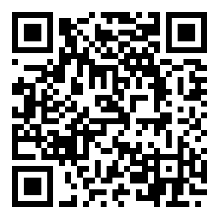

# Поддержать проект

Проект некоммерческий, делаю как хобби. Если захочется поблагодарить, реквизиты ниже. Если нет, всё равно спасибо за доверие. Без обязательств и подписок.

## USDT · сети EVM

Один адрес для всех сетей EVM:

`0x24919d8a46357D83fe935F02BEbE55b1b7c360B8`

Принимаемые сети (все ведут на этот адрес): Arbitrum One, Optimism, Polygon, BNB Smart Chain (BEP20), Avalanche C-Chain, Ethereum (ERC20).

### Комиссии

| Сеть | Комиссия |
|---|---|
| Arbitrum One / Optimism / Polygon / BNB Smart Chain / Avalanche C-Chain | низкая, доли цента |
| Ethereum (ERC20) | работает, но газ дорогой - используйте, только если нет варианта дешевле |

### Как отправить

Выведите USDT с биржи (например, Binance, Bybit, OKX) на адрес выше, выбрав одну из сетей EVM из списка. Перед отправкой всегда сверяйте, что выбранная сеть совпадает с одной из перечисленных.

> **Адрес работает только в сетях EVM.** Не отправляйте через TON, TRON (TRC-20) или Solana - средства будут потеряны.
